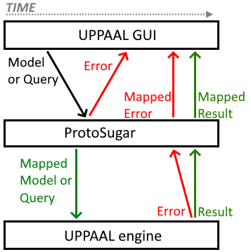

# UPPAAL ProtoSugar
UPPAAL ProtoSugar – short for "_**Proto**typer for Syntactic **Sugar**_" – allows for quick and cheap prototyping of new language features by means of mapping/rewriting models, thus circumventing the need to spend many hours implementing the full feature in the UPPAAL engine before being able to test it in a practical setting.

ProtoSugar is a "middleware" that is integrated between the UPPAAL GUI and the UPPAAL engine where it intercepts and rewrites certain commands/responses going between the GUI and engine. The image below shows a simplified overview of ProtoSugar's integration and functionality, where some things are simplified and some are left out.

**Image explanation:** The image depicts how an input model or query is intercepted by ProtoSugar and mapped. If the mapping succeeds, the result is sent to the engine, otherwise, errors are returned to the GUI. Next, the engine either returns a successful result or a list of errors. A successful result is simply sent to the GUI, whereas errors are put through the mapping in reverse order to "back-map" them onto their "correct locations" in the original input (since the errors are generated on the mapped input).

# Documentation
All releases of ProtoSugar (and custom UPPAAL builds for some mappers) can be found on the [releases page](https://github.com/DEIS-Tools/UPPAAL-ProtoSugar/releases).

The [ProtoSugar Wiki](https://github.com/DEIS-Tools/UPPAAL-ProtoSugar/wiki) here on GitHub contains the following:
1. "[Usage](https://github.com/DEIS-Tools/UPPAAL-ProtoSugar/wiki/1-Usage)": A guide to download and configure ProtoSugar.
2. "[Mappers](https://github.com/DEIS-Tools/UPPAAL-ProtoSugar/wiki/2-Mappers)": An overview of all mappers.
   - Each section 2.X describes a particular mapper in depth.
3. "[Framework structure](https://github.com/DEIS-Tools/UPPAAL-ProtoSugar/wiki/3-Framework-structure)": Describes the codebase and how to implement a mapper.
