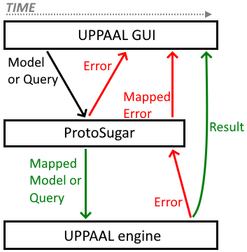

# UPPAAL ProtoSugar
UPPAAL ProtoSugar – short for "_**Proto**typer for Syntactic **Sugar**_" – allows for quick and cheap prototyping of new language features by means of mapping/rewriting models, thus circumventing the need to spend many hours implementing the full feature in the UPPAAL engine before being able to test it in a practical setting.

ProtoSugar is a "middleware" that is integrated between the UPPAAL GUI and the UPPAAL engine where it intercepts and rewrites certain commands/responses going between the GUI and engine. The image below shows a simplified overview of ProtoSugar's integration and functionality, where some things are simplified and some are left out (see Section 3 for in-depth explanations).

**Image explanation:** The image depicts how an input model or query is intercepted by ProtoSugar and mapped. If the mapping succeeds, the result is sent to the engine, otherwise, errors are returned to the GUI. Next, the engine either returns a successful result or a list of errors. A successful result is simply sent to the GUI, whereas errors are put through the mapping in reverse order to "back-map" them onto their "correct locations" in the original input (since the errors are generated on the mapped input).

**Supports multiple mappers:** ProtoSugar is both 1) a "mapping framework" and 2) a "mapper orchestrator", since 1) it has facilities for defining individual "Mappers" for every new language feature to prototype, and 2) it allows the user to enable/disable individual mappers and have multiple mappers enabled at once (Section 2 lists all mappers). 

The remainder of this document is structured as follows:
- "1. How to use": Explains how to configure ProtoSugar in UPPAAL and other basic know-how.
- "2. Mappers in detail": Explains all available mappers in more detail. It also includes examples of why they are suggested as potential features.
- "3. Architecture and extensibility": Explains how the ProtoSugar framework works and how to implement new mappers.

## 1. How to use
This section explains how to use a released/pre-compiled version of ProtoSugar. If you want to compile the code yourself or contribute to the project, you should look at Section 3 instead.

### 1.1 Prerequisites
- Java 11 or later is required to run ProtoSugar.
- ProtoSugar has been tested with "*UPPAAL 4.1.20-stratego-10*" and "*UPPAAL 4.1.20-stratego-11-rc2*", but as long as the UPPAAL engine's API or protocols do not change, ProtoSugar should keep working with future UPPAAL versions.

### 1.2 Installation and configuration
Note that since all UPPAAL installations share the list of registered engines, configuring ProtoSugar once configures it for all UPPAAL installations.

**1. Obtaining the software:** Download the latest release of ProtoSugar from the ["Releases" page](https://github.com/DEIS-Tools/UPPAAL-ProtoSugar/releases) on the ProtoSugar GitHub page. Save it in a central location that is independent of any one UPPAAL installation. This could be in "Documents", the "home" folder, on the "Desktop", the "Programs"-folder, or any other convenient place depending on your operating system.

**2.1. Register ProtoSugar as UPPAAL engine:** Launch UPPAAL and go to the "Edit > Engines..."-menu. Click the "New Command"-button in the "Edit Engine Connections" pop-up and give the new command the title "ProtoSugar". Next, give it a command of the following pattern:

- `java -jar [absolute/path/to/ProtoSugar.jar] -server [relative/path/to/server-program] -mappers [List of mappers]`

I recommend using an absolute file-path to the ProtoSugar-jar and a relative path to the server file (Windows: `bin\server.exe`, Linux/Mac: `bin/server`). In this way, the GUI always uses the same version of ProtoSugar, but also always uses the "Bundled" server version that comes with each UPPAAL version/installation. Thus, ProtoSugar only ever needs to be updated in one place and  there will be no need to change the engine/command each time UPPAAL is updated.

**2.2. Configure mappers:** To configure which mappers should be enabled, simply list the code-names (see Section 2) of the desired mappers – separated by spaces – after the `-mappers`-flag. An example of this is shown below:

- Example: `java -jar [...] -server [...] -mappers PaCha SeComp`

Press "Save" in the "Edit Engine Connections" pop-up.

**3. Select the ProtoSugar engine**: Finally, in the UPPAAL GUI, press "Edit > Engine > ProtoSugar" to select the newly added engine. If everything is done right, UPPAAL should detect and connect to ProtoSugar as any other engine.

IMPORTANT: The "order of mappers" on the command line may influence whether the mappers will work properly or not. See Section 1.4 for more info.

### 1.3 Map model-file from command line
It is possible to map a single UPPAAL model-file (in XML format) from the command line using a command of the form shown below:

- `java -jar [absolute/path/to/ProtoSugar.jar] -file [path/to/uppaal-model.xml] -mappers [List of mappers]`

If the enabled mappers do not return any errors, the above will output the mapped model (to `stdout` in XML format) which would otherwise have been sent to the UPPAAL engine if run from the UPPAAL GUI. If errors are present, these will instead be printed to `stdout` in JSON format.

IMPORTANT: The "order of mappers" on the command line may influence whether the mappers will work properly or not. See Section 1.4 for more info.

### 1.4 Additional notes
#### 1.4.1 Order of mappers
The input model or query is run through the enabled mappers in the order in which the mappers are mentioned on the command line. Depending on how a mapper parses the model and detects what to map/rewrite, this order could determine whether a mapper fails or not.

For example, the `TxQuan` mapper adds textual names for the query quantifiers (i.e., `A[]` can be written as `ALWAYS`, and `-->` as `LEADSTO`), but the `SeComp` mapper does not expect correct queries to have text in these places. Therefore, the `TxQuan` mapper should be enabled **before** the `SeComp` mapper to make sure that the textual query quantifiers have been "mapped away" before going through the `SeComp` mapper.

As of writing, there should not be any other mapper conflicts, but as more mappers (or different versions of mappers) are added, this might change.

#### 1.4.2 Feature completeness and error reporting
ProtoSugar is just a framework for rewriting models, and not a fully fledged compiler. As such, the feature(s) implemented by each mapper may not necessarily work in all cases and error reporting might not be entirely accurate depending on how well the mapper detects an attempt at using said feature(s).

If odd errors show up in connection with any of the new features, there might be a syntax error that hinders the corresponding mapper from recognizing the new syntax, and thus also hinders it from reporting the correct errors.

## 2. Mappers in detail
This section lists all mappers currently implemented in ProtoSugar, including descriptions of which feature(s) they add as well as examples/rationale describing why these features are suggested as potential additions to UPPAAL.

In the following, "_native [...]_" will refer to how the syntax or semantics in normal UPPAAL works. For example: native query quantifiers `A[]`, `E<>`, etc.; or, the native channel type: `chan`.

The sections below are structured as "`CodeName` – Full Name". As mentioned in Section "1.2 Installation and configuration", the `CodeName` is used to activate the mapper when launching ProtoSugar.

### 2.1 `TxQuan` – **T**e**x**tual Query **Quan**tifiers
This mapper adds textual alternatives to the native query quantifiers as described in the table further below (where `p` and `q` are boolean expressions). 

**Rationale:** The textual query quantifiers are (hopefully) easier to explain to, and understand for, new UPPAAL users. This could help them better understand how queries work and have an easier time getting started with UPPAAL.

| New            | Native        |
|----------------|---------------|
| `ALWAYS p`     | `A[] p`       |
| `EVENTUALLY p` | `A<> p`       |
| `POSSIBLY p`   | `E<> p`       |
| `AVOIDABLE p`  | `E[] (not p)` |
| `p LEADSTO q`  | `p --> q`     |

The mapper adds an alternative to "`E[] (not p)`", and not "`E[] p`", due to the lack of a single word that properly describes the effect of "`E[] p`". Suggestions are welcome.

#### 2.1.1 Examples
- `ALWAYS not Device.Error`
- `EVENTUALLY Device.Done && Device.result == EXPECTATION`
- `POSSIBLY Device.Recalibrating`
- `AVOIDABLE Device.value < MINIMUM || Device.value > MAXIMUM`
- `Device1.Sending LEADSTO Device2.Receiving`

### 2.2 `AutoArr` – **Auto** **Arr**ays
This mapper adds a new syntax for instantiating arrays (of type `int` or `bool`) based on a "lambda expression" that takes the index of all array dimensions as input.

**Rationale:** Apart from making it possible to auto-generate different values for each array position, this also makes it easier to initialize huge arrays since the user does not need to enter every value for every position.

#### 2.2.1 Syntax and Semantics
The syntax follows the pattern below presented. To ignore the index of one or more dimensions, simply give the corresponding dimension variables the name "`_`" (underscore).

- `Type Identifier [SIZE_1][...][SIZE_N] = { IndexVar_1, ..., IndexVar_N -> Expression };`

`AutoArr` replicates the expression once for every array position where the index variables are substituted by their actual value depending on the array position. It is considered an error to use the ignored "`_`" (underscore) index variables.

#### 2.2.2 Limitations
- `AutoArr` only works on arrays with type `int` or `bool`.
- `AutoArr` only works when every `SIZE_x` is either an integer-primitive (e.g. `7`), or an integer constant whose value is given directly as an integer-primitive (e.g. `const int LENGTH = 7`).
    1. Sizes that don't work include `1+2` or `LEN` where `const int LEN = 3+OTHER_CONST`.
    2. Bounded integers and typedefs (i.e. `int[1,2]` or `typedef int[1,2] device_range`) cannot be used as the size.
    3. Functions (even if computable at compile-time) cannot be used as the size.
    4. Template parameters (even if constant) cannot be used as the size.
- `AutoArr` cannot parse multiple constants defined in the same declaration (e.g. "`const int A = 1, B = 2;`"). 

Otherwise, there should be full support/integration for all other language features.

#### 2.2.3 Examples
- `bool huge[200] = { _ -> false };`
- `bool isActive[NUM_DEVICES] = { i -> i % 2 == 0 };`
- `int list[10] = { i -> i }`
- `int matrix[10][10] = { i, j -> func(i, j) }`
- `int cube[10][10][10] = { i, j, k -> func(i, j, k) }`

### 2.3 `PaCha` – **Pa**rameterized **Cha**nnels
This mapper adds parameterization and value-passing to channels and synchronizations. It expands the native `chan`-type syntax with an optional "type list" (see "2.3.1 Syntax and Semantics") that states how many values, and of what type, said channel will pass from the emitter to the receiver when two processes synchronize.

**Rationale:** It is not unusual for processes to exchange data, but there is no native value-passing feature in UPPAAL. A typical solution is to declare some global state that the processes can use to interact, but this clutters the global state-space and "moves data out of" processes. Thus, this mapper emulates direct value-passing between processes which allows the emitter and receiver to seamlessly exchange local data when synchronizing. This also removes clutter from the global state-space. (See Section "2.3.3 Examples" for the Gossip Example with and without parameterized channels.)

#### 2.3.1 Syntax and Semantics
The syntax follows the patterns shown below, where for each channel identifier, `Identifier`, all instances of `N` has the same value and all instances of `M` have the same value. Whether the channel is declared as an array or not is optional. Any valid constant expression (or integer range) can be used as the size of an array dimension. All types (even typedefs) apart from explicit structs and references are supported in the channel type list (typedefs that represent structs are supported).

- Declaration: `chan(Type_1, ..., Type_N) Identifier[SIZE_1][...][SIZE_M];`
- Emit: `Identifier[Index_1][...][Index_M](Expr_1, ..., Expr_N)!`
- Receive: `Identifier[Index_1][...][Index_M]([meta] Var_1, ..., [meta] Var_N)?` (`[meta]` means that meta is optional)

Once declared, a parameterized channel can be used like any other channel variable, but only where the use is type correct. It can even be given as a parameter to a template. 

When a process emits on a channel (e.g. "`pacha(12, true)!`"), the value of each `Expr_x` is transferred to the variable `Var_x` on the synchronizing process that receives on said channel (e.g. "`pacha(localIntVar, meta temporaryBooleanVar)`"). 

Receiver variables declared as "meta" only exist temporarily and only in the scope of the "update/assignment" clause of the receiving edge. Meta-variables are useful when a value is important to update some state, but there is no reason to save the value in a local variable. This can thus save a local variable on the receiving process.

All non-meta variables must have been defined beforehand.

#### 2.3.2 Limitations
- `PaCha` does not support `struct` or reference types in a parameterized channel's "type list".
    - It does support typedef names, even if that typedef is a struct. Similarly, a struct expression is not supported when emitting on a parameterized channel, but a struct variable may be passed.
- `PaCha` cannot parse multiple parameterized channels defined in the same declaration (e.g. "`chan(int) ch1, ch2[NUM];`").

There should otherwise be no other limitations.

#### 2.3.3 Examples
This section presents two versions of the "gossiping girls" algorithm that are made using native UPPAAL and using parameterized channels.

**Algorithm:** a number of processes initially all know one secret and must exchange secrets with each other until all of them know all secrets. The processes are capable of one-to-one communication with any other process (i.e. no 3-or-more-way conferencing). A process will take anywhere from 5 to 10 time units to respond.

| Native UPPAAL using shared, global state        |
| ----------------------------------------------- |
|  |
| All state and merge-logic is stored in the global scope. Edges contain a lot of "management logic". The receiver executes the merge-logic both for itself and the emitter, whereas it would make most sense for the emitter to handle its own state. |

| New shorthand syntax by `PaCha`                |
| ---------------------------------------------- |
|  |
| Secrets and merge-logic are moved into the template. The channel `send` no longer needs to be an array which also removes the "select" clause on the "Pending -> Answering transition. Also, the text/code on the edges in the template is more compact/concise and merge-logic is only executed on receiver-edges, where it makes the most sense. |

### 2.4 `SeComp` – **Se**quential **Comp**osition
This mapper adds 

#### 2.4.1 Syntax and Semantics

#### 2.4.2 Limitations
- Sub-templates cannot have parameters.
- Templates that use sub-templates cannot have free scalar parameters.

#### 2.4.3 Examples

## 3. Architecture and extensibility
Kotlin

### How is ProtoSugar structured

### How to make a new mapper

