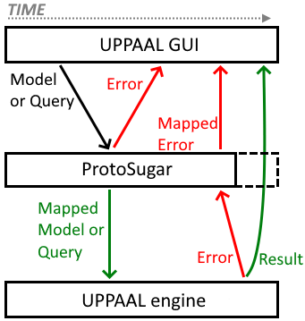
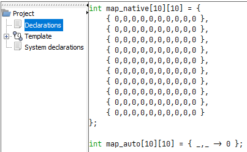
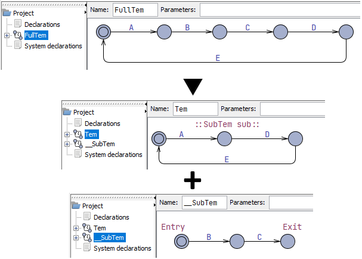
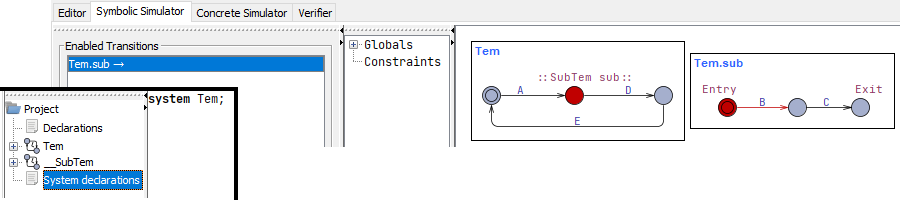

# UPPAAL ProtoSugar
UPPAAL ProtoSugar – short for "_**Proto**typer for Syntactic **Sugar**_" – allows for quick and cheap prototyping of new language features by means of mapping/rewriting models, thus circumventing the need to spend many hours implementing the full feature in the UPPAAL engine before being able to test it in a practical setting.

ProtoSugar is a "middleware" that is integrated between the UPPAAL GUI and the UPPAAL engine where it intercepts and rewrites certain commands/responses going between the GUI and engine. The image below shows a simplified overview of ProtoSugar's integration and functionality, where some things are simplified and some are left out (see Section 3 for in-depth explanations).



**Image explanation:** The image depicts how an input model or query is intercepted by ProtoSugar and mapped. If the mapping succeeds, the result is sent to the engine, otherwise, errors are returned to the GUI. Next, the engine either returns a successful result or a list of errors. A successful result is simply sent to the GUI, whereas errors are put through the mapping in reverse order to "back-map" them onto their "correct locations" in the original input (since the errors are generated on the mapped input).

**Supports multiple mappers:** ProtoSugar is both 1) a "mapping framework" and 2) a "mapper orchestrator", since 1) it has facilities for defining individual "Mappers" for every new language feature to prototype, and 2) it allows the user to enable/disable individual mappers and have multiple mappers enabled at once (Section 2 lists all mappers). 

The remainder of this document is structured as follows:
- "1. How to use": Explains how to configure ProtoSugar in UPPAAL and other basic know-how.
- "2. Mappers in detail": Explains all available mappers in more detail. It also includes examples of why they are suggested as potential features.
- "3. Architecture and extensibility": Explains how the ProtoSugar framework works and how to implement new mappers.


## 1. How to use
This section explains how to use a released/pre-compiled version of ProtoSugar. If you want to compile the code yourself or contribute to the project, you should look at Section 3 instead.


### 1.1 Prerequisites
- Java 11 or later is required to run ProtoSugar.
- ProtoSugar has been tested with "*UPPAAL 4.1.20-stratego-10*" and "*UPPAAL 4.1.20-stratego-11*", but as long as the UPPAAL engine's API and/or communication protocols do not change, ProtoSugar should keep working with future UPPAAL versions.


### 1.2 Installation and configuration
Note that since all UPPAAL installations share the list of registered engines, configuring ProtoSugar once configures it for all UPPAAL installations.

**1. Obtaining the software:** Download the latest release of ProtoSugar from the ["Releases" page](https://github.com/DEIS-Tools/UPPAAL-ProtoSugar/releases) on the ProtoSugar GitHub page. Save it in a central location that is independent of any one UPPAAL installation. This could be in "Documents", the "home" folder, on the "Desktop", the "Programs"-folder, or any other convenient place depending on your operating system.

**2.1. Register ProtoSugar as UPPAAL engine:** Launch UPPAAL and go to the "Edit > Engines..."-menu. Click the "New Command"-button in the "Edit Engine Connections" pop-up and give the new command the title "ProtoSugar". Next, give it a command of the following pattern:

- `java -jar [absolute/path/to/ProtoSugar.jar] -server [relative/path/to/server-program] -mappers [List of mappers]`

I recommend using an absolute file-path to the ProtoSugar-jar and a relative path to the server file (Windows: `bin\server.exe`, Linux/Mac: `bin/server`). In this way, the GUI always uses the same version of ProtoSugar, but also always uses the "Bundled" server version that comes with each UPPAAL version/installation. Thus, ProtoSugar only ever needs to be updated in one place and  there will be no need to change the engine/command each time UPPAAL is updated.

**2.2. Configure mappers:** To configure which mappers should be enabled, simply list the code-names (see Section 2) of the desired mappers – separated by spaces – after the `-mappers`-flag. An example of this is shown below:

- Example: `java -jar [...] -server [...] -mappers PaCha SeComp`

Press "Save" in the "Edit Engine Connections" pop-up.

**3. Select the ProtoSugar engine**: Finally, in the UPPAAL GUI, press "Edit > Engine > ProtoSugar" to select the newly added engine. If everything is done right, UPPAAL should detect and connect to ProtoSugar as any other engine.

IMPORTANT: The "order of mappers" on the command line may influence whether the mappers will work properly or not. See Section 1.4 for more info.


### 1.3 Map model-file from command line
It is possible to map a single UPPAAL model-file (in XML format) from the command line using a command of the form shown below:

- `java -jar [absolute/path/to/ProtoSugar.jar] -file [path/to/uppaal-model.xml] -mappers [List of mappers]`

If the enabled mappers do not return any errors, the above will output the mapped model (to `stdout` in XML format) which would otherwise have been sent to the UPPAAL engine if run from the UPPAAL GUI. If errors are present, these will instead be printed to `stdout` in JSON format.

IMPORTANT: The "order of mappers" on the command line may influence whether the mappers will work properly or not. See Section 1.4 for more info.


### 1.4 Additional notes
#### 1.4.1 Order of mappers
The input model or query is run through the enabled mappers in the order in which the mappers are mentioned on the command line. Depending on how a mapper parses the model and detects what to map/rewrite, this order could determine whether a mapper fails or not.

For example, the `TxQuan` mapper adds textual names for the query quantifiers (i.e., `A[]` can be written as `ALWAYS`, and `-->` as `LEADSTO`), but the `SeComp` mapper does not expect correct queries to have text in these places. Therefore, the `TxQuan` mapper should be enabled **before** the `SeComp` mapper to make sure that the textual query quantifiers have been "mapped away" before going through the `SeComp` mapper.

As of writing, there should not be any other mapper conflicts, but as more mappers (or different versions of mappers) are added, this might change.

#### 1.4.2 Feature completeness and error reporting
ProtoSugar is just a framework for rewriting models, and not a fully fledged compiler. As such, the feature(s) implemented by each mapper may not necessarily work in all cases and error reporting might not be entirely accurate depending on how well the mapper detects an attempt at using said feature(s).

If odd errors show up in connection with any of the new features, there might be a syntax error that hinders the corresponding mapper from recognizing the new syntax, and thus also hinders it from reporting the correct errors.


## 2. Mappers in detail
This section lists all mappers currently implemented in ProtoSugar, including descriptions of which feature(s) they add as well as examples/rationale describing why these features are suggested as potential additions to UPPAAL.

In the following, "_native [...]_" will refer to how the syntax or semantics in normal UPPAAL works. For example: native query quantifiers `A[]`, `E<>`, etc.; or, the native channel type: `chan`.

The sections below are structured as "`CodeName` – Full Name". As mentioned in Section "1.2 Installation and configuration", the `CodeName` is used to activate the mapper when launching ProtoSugar.

### 2.1 `TxQuan` – Textual Query Quantifiers
This mapper adds textual alternatives to the native query quantifiers as described in the table further below (where `p` and `q` are boolean expressions). 

**Rationale:** The textual query quantifiers are (hopefully) easier to explain to, and understand for, new UPPAAL users. This could help them better understand how queries work and have an easier time getting started with UPPAAL.

| New            | Native        |
|----------------|---------------|
| `ALWAYS p`     | `A[] p`       |
| `EVENTUALLY p` | `A<> p`       |
| `POSSIBLY p`   | `E<> p`       |
| `AVOIDABLE p`  | `E[] (not p)` |
| `p LEADSTO q`  | `p --> q`     |

The mapper adds an alternative to "`E[] (not p)`", and not "`E[] p`", due to the lack of a single word that properly describes the effect of "`E[] p`". Suggestions are welcome.

#### 2.1.1 Examples
- `ALWAYS not Device.Error`
- `EVENTUALLY Device.Done && Device.result == EXPECTATION`
- `POSSIBLY Device.Recalibrating`
- `AVOIDABLE Device.value < MINIMUM || Device.value > MAXIMUM`
- `Device1.Sending LEADSTO Device2.Receiving`


### 2.2 `AutoArr` – Auto Arrays
This mapper adds a new syntax for instantiating arrays (of type `int` or `bool`) based on a "lambda expression" that takes the index of all array dimensions as input. In the image below, both the "native" and "auto" versions result in a 10x10 matrix of zeros.



**Rationale:** Apart from making it possible to auto-generate different values for each array position, this also makes it easier to initialize huge arrays since the user does not need to enter every value for every position.

#### 2.2.1 Syntax and Semantics
The syntax follows the pattern presented below. To ignore the index of one or more dimensions, simply give the corresponding dimension variable(s) the name "`_`" (underscore).

- `Type Identifier [SIZE_1][...][SIZE_N] = { IndexVar_1, ..., IndexVar_N -> Expression };`

`AutoArr` replicates the expression once for every array position where the index variables are substituted by their actual value depending on the array position. It is considered an error to use the ignored "`_`" (underscore) index variables.

#### 2.2.2 Limitations
- `AutoArr` only works on arrays with type `int` or `bool`.
- `AutoArr` only works when every `SIZE_x` is either an integer-primitive (e.g. `7`), or an integer constant whose value is given directly as an integer-primitive (e.g. `const int LENGTH = 7`).
    1. Sizes that don't work include `1+2` or `LEN` where `const int LEN = 3+OTHER_CONST`.
    2. Bounded integers and typedefs (i.e. `int[1,2]` or `typedef int[1,2] device_range`) cannot be used as the size.
    3. Function results (even if computable at compile-time) cannot be used as the size.
    4. Template parameters (even if constant) cannot be used as the size.
- `AutoArr` cannot parse multiple constants defined in the same declaration (e.g. "`const int A = 1, B = 2;`"). 

Otherwise, there should be full support/integration for all other language features.

#### 2.2.3 Examples
- `bool huge[200] = { _ -> false };`
- `bool isActive[NUM_DEVICES] = { i -> i % 2 == 0 };`
- `int list[10] = { i -> i }`
- `int matrix[10][10] = { i, j -> func(i, j) }`
- `int cube[10][10][10] = { i, j, k -> func(i, j, k) }`


### 2.3 `PaCha` – Parameterized Channels
This mapper adds parameterization and value-passing to channels and synchronizations. It expands the native `chan`-type syntax with an optional "type list" (see "2.3.1 Syntax and Semantics") that states how many values, and of what type, said channel will pass from the emitter to the receiver when two processes synchronize.

**Rationale:** It is not unusual for processes to exchange data when synchronizing, but there is no native value-passing feature in UPPAAL. A typical solution is to declare some global state that the processes can use to interact, but this clutters the global state-space and "moves data out of" processes. Thus, this mapper emulates direct value-passing between processes which allows the emitter and receiver to seamlessly exchange local data when synchronizing. This also removes clutter from the global state-space. (See Section "2.3.3 Examples" for the Gossip Example with and without parameterized channels.)

#### 2.3.1 Syntax and Semantics
The syntax follows the patterns shown below, where for each channel identifier, `Identifier`, all instances of `N` has the same value and all instances of `M` have the same value. Whether the channel is declared as an array or not is optional. Any valid constant expression (or integer range) can be used as the size of an array dimension. All types (even typedefs) apart from explicit structs and references are supported in the channel type list (typedefs that represent structs are supported).

- Declaration: `chan(Type_1, ..., Type_N) Identifier[SIZE_1][...][SIZE_M];`
- Emit: `Identifier[Index_1][...][Index_M](Expr_1, ..., Expr_N)!`
- Receive: `Identifier[Index_1][...][Index_M]([meta] Var_1, ..., [meta] Var_N)?` (`[meta]` means that meta is optional)

Once declared, a parameterized channel can be used like any other channel variable, but only where the use is type correct. It can even be given as a parameter to a template. 

When a process emits on a channel (e.g. "`pacha(12, true)!`"), the value of each `Expr_x` is transferred to the variable `Var_x` on the synchronizing process that receives on said channel (e.g. "`pacha(localIntVar, meta temporaryBooleanVar)`"). 

Receiver variables declared as "meta" only exist temporarily and only in the scope of the "update/assignment" clause of the receiving edge. Meta-variables are useful when a value is important to update some state, but there is no reason to save the value in a local variable. This can thus save a local variable on the receiving process.

All non-meta variables must have been defined beforehand.

#### 2.3.2 Limitations
- `PaCha` does not support `struct` or reference types in a parameterized channel's "type list".
    - It does support typedef names, even if that typedef is a struct. Similarly, a struct expression is not supported when emitting on a parameterized channel, but a struct variable may be passed.
- `PaCha` cannot parse multiple parameterized channels defined in the same declaration (e.g. "`chan(int) ch1, ch2[NUM];`").

There should otherwise be no other limitations.

#### 2.3.3 Examples
This section presents two versions of the "gossiping girls" algorithm that are made using native UPPAAL and using parameterized channels.

**Algorithm:** a number of processes initially all know one secret and must exchange secrets with each other until all of them know all secrets. The processes are capable of one-to-one communication with any other process (i.e. no 3-or-more-way conferencing). A process will take anywhere from 5 to 10 time units to respond.

| Native UPPAAL using shared, global state        |
| ----------------------------------------------- |
|  |
| All state and merge-logic is stored in the global scope. Edges contain a lot of "management logic". The receiver executes the merge-logic both for itself and the initial emitter, whereas it would make most sense for the emitter to handle its own state. |

| New shorthand syntax by `PaCha`                |
| ---------------------------------------------- |
|  |
| Secrets and merge-logic are moved into the template. The channel `send` no longer needs to be an array which also removes the "select" clause on the "Pending -> Answering transition. Also, the text/code on the edges in the template is more compact/concise and merge-logic is only executed on receiver-edges, where it makes the most sense. |

### 2.4 `SeComp` – Sequential Composition
This mapper adds support for "sub-templates", which can be embedded into "normal" templates and other sub-templates in the form of a single location. This one location in the "parent template" thus represents an entire sub-template underneath. The image below illustrates this concept. The top automaton is behaviorally equivalent to the two below automata combined.



**Rationale:** Sequential composition is both a mechanism for abstraction/minimization and for reuse. Big and complicated parts of an automata can be hidden away in a sub-template and duplicated/shared behavior only needs to be modeled once. With parameterization (planned feature, see Sections 2.4.2 and 2.4.3), it is also possible to reuse generic behavior in a flexible way.

#### 2.4.1 Syntax and Semantics
This section describes how to define a sub-template, how to embed a sub-template into another template, how sub-templates appear in the simulator, and how to query sub-templates.

##### 2.4.1.1 Define a sub-template
To declare a template as a sub-template, simply prepend its name with two underscores, e.g., `__SubTem` as shown in the image above. 

A sub-template must have at least one "entry" and one "exit" location that are separate, and one transition. The initial location will serve as the "entry location" to the sub-template and any location with no outgoing transitions will act as an "exit location". If an exit location is reached, control is returned to the parent and the sub-template returns to its entry location, thus waiting to receive control again.

The next section explains how control is passed from a parent to a sub-template.

##### 2.4.1.2 Instantiate/embed a sub-template
To embed/instantiate a sub-template into some parent template, give a location in the parent template a name of the following form: ``::[SubTemplate name] [instance name]::``, where the "`SubTemplate name`" does not need to include the first two underscore and "`[instance name]`" must be any valid identifier. An example is `::SubTem sub::` from the image above. Whenever the parent template is instantiated, a sub-template is instantiated as well for each "embed location" in said parent.

_**NOTE1:** You cannot instantiate a sub-template in user-code (i.e., on the `system` line in `System declarations`). Sub-templates are only instantiated when a normal template that uses sub-templates is instantiated._

_**NOTE2:** You may leave out the "`[instance name]`" in which case the corresponding state has no name and cannot be used in queries._

Whenever a parent process enters an embed location, control is transferred to the sub-template instance that correspond to that location, and as mentioned above, whenever the sub-template reaches an exit location, control is restored to the parent.

##### 2.4.1.3 Process names and simulation
Since the UPPAAL GUI is not capable of drawing one template into another, the best approximation is to make an instance of a parent template and all its sub-templates, and then name the sub-templates thereafter. The image below shows the system modeled above in the simulator. Notice how only `Tem` is instantiated in the "System declarations", but both `Tem` and `Tem.sub` are processes in the simulator. All sub-template instances have this naming-relationship with their parent instance.



Notice also how, even though `Tem` is currently in a location that should allow it to take the `D`-edge, only the `B`-edge on `Tem.sub` show up as an enabled transition. Only when `Tem.sub` has reached the exit location may `Tem` continue.

If you leave the instance name blank on the embed location, an autogenerated name such as `Tem.SubTem(0)` is generated instead, which will be harder to read in case there are multiple nameless `SubTem` instances on the same parent.

##### 2.4.1.4 Query a sub-template
To query a sub-template, simply use the exiting DOT-notation. To query if `Tem.sub` can enter its exit location, simply write "`E<> Tem.sub.Exit`". You can query/use any location, function, or variable (even structs which also use the DOT-notation).

_**NOTE:** Even though nameless sub-template instances get a readable name (e.g., `Tem.SubTem(0)`), using such names/locations in a query will produce an error._

#### 2.4.2 Limitations
- Sub-templates cannot have parameters, though they can access global variables like all other templates.
- If templates (and partial instantiations) that use sub-templates have free scalar parameters, these cannot be freely instantiated (i.e. directly mentioned on the "system"-line).
- The mapper must be able to infer the number of all instantiated normal templates that use sub-templates, in order to compute how many sub-templates must be instantiated. Since the mapper is not a complete parser/compiler, it might not understand the instantiation logic if it is too complicated.
  - For example, if the result of a compile-time-computable function determines the number of instances of some template, the mapper would not be able to compute that.
- `SeComp` cannot parse multiple constants defined in the same declaration (e.g. "`const int A = 1, B = 2;`").

#### 2.4.3 Planned features
- Hierarchies: It should be possible to define a sub-template in the scope of another (sub-)template (i.e., not directly in the global scope), which would allow a sub-template to access the instance-variables of the parent (sub-)template instance(s). Just like how a method in a class can access the values of it's class' class-variables, and not just the variables defined in the method.
- Parametrization: Sub-templates should support parameters. It should be possible to pass any variable that is "in scope" wherever a sub-template is instantiated.


## 3. Architecture and extensibility
ProtoSugar is a command line program written in Kotlin and built using Gradle (all through JetBrains IntelliJ). In the following Section "3.1 Structure of ProtoSugar" explains how the code of ProtoSugar is structured. Section "3.2 Dataflow through ProtoSugar" explains which data ProtoSugar intercepts and where/how it is mapped. Section "3.3 Implementing a mapper" explains how to compile the source code and how to implement a new mapper. Section "3.4 Compile and Run" explains how to compile and run ProtoSugar.


### 3.1 Structure of ProtoSugar
The code is structured into three general parts: "`main`", "`uppaal`", and "`mapping`".

1. "`main`": Consisting of just the `Main.kt`-file, this is where the enabled mappers are configured and where the program is set up to either map a single model-file or act as a UPPAAL engine to integrate with the GUI.
2. "`uppaal`": This package contains model-classes to represent "UPPAAL errors" and "UPPAAL models". These are used for parsing inputs and producing (mapped) outputs.
3. "`mapping`": This package contains the various different mappers, as well as facilities for parsing and rewriting/mapping the textual parts of UPPAAL models.

#### 3.1.1 Main-part
The main function first parses the command line input to determine which "mode" it should run in, and which mappers should be enabled. The available modes are "file", "server", and "debug", however, debug has not been used in a long time and was mostly used to understand the data flow, so it will not be covered in depth here.

In file-mode, the mapper simply maps the input-model and outputs the result (be that errors or a successful mapping) to the standard output.

In server-mode, ProtoSugar runs the UPPAAL server on the provided path and sets up four data streams: "`GUI -> ProtoSugar`", "`ProtoSugar -> Engine`", "`Engine -> ProtoSugar`", and "`ProtoSugar -> GUI`". The code can thus inspect all data going between the GUI and engine, and if the data is a parse-model-command, a run-query-command, or a response to either of these, the data is intercepted and possibly mapped. Section 3.2 describes this dataflow in more detail.

#### 3.1.2 Uppaal-part
The `uppaal`-part is split into the `model` and `error` sub-parts.

The `model`-part contains classes for storing (and outputting) the tree structure and data of a UPPAAL model. The `Simple XML` Kotlin library is used to parse the UPPAAL model file (XML format) into objects of these classes. All of these classes implement the marker-interface `UppaalPojo`, which simply allows the code to generalize all UPPAAL model objects (see for example below).

The `error`-part contains classes for storing (and outputting) UPPAAL error data, two of which are the `UppaalPath` and `LineColumnRange` classes. The `UppaalPath` class is just a list of `UppaalPojo` objects that represents a path to some object in the loaded UPPAAL model. Since UPPAAL bases "text-ranges" on start/end lines/columns (and not character position), the `LineColumnRange` class is implemented to store this data and also to map between line/column-ranges and character-ranges. Finally, these come together in the `UppaalError` class which stores all information from a UPPAAL error (i.e., path, range, message, and context), as well as some metadata to denote severity and order of creation.

#### 3.1.3 Mapping-part
The `part` part contains the `Orchestrator`, as well as the `mappers`, `parsing`, and `rewriting` sub-parts.

The `Orchestrator` and the `mapper`-part are closely related. Each mapper implements zero or more "model phases", zero or one "simulation phases", and zero or one "query phases". If implemented, each of these phase-types lets a mapper modify certain data going between the GUI and engine. Multiple model phases are supported in case multiple "runs" through the model is required to properly index/validate/map the input. See also the `Mapper`-interface which all mappers must implement. Next, the `Orchestrator` is responsible for passing models and queries through the enabled mappers' phases before sending this to the engine. It also passes responses back through the relevant phases before going to the GUI. Section 3.2 describes this dataflow in more detail.

The `parsing`-part contains the "`Confre`" and related helpers. The `Confre`-class is like the `Regex`-class, but for context-free grammars instead. The `Confre` takes a string with a context-free grammar as its constructor input, and is afterwards capable of parsing text that matches the grammar into a "parse tree" (see also the `ParseTree`, `Node`, and `Leaf` classes). The confre supports the operations: "match exact", "find", and "find all". The `Confre` was made since regexes usually aren't strong enough to properly describe all UPPAAL syntax and since maintaining regexes for patterns as complex as what these mappers are supposed to map is nearly impossible. Section 3.3 describes how to use the `Confre` in more detail.

The `rewriting`-part contains the `Rewriter`-class and its related `BackMap`-classes. Practically all mappers need to rewrite some original input text either by "inserting", "replacing", or "appending" new text. Thus, the `Rewriter` provides this functionality. Furthermore, since the mappers (and their phases) are run sequentially, many "layers of transformation" may be applied to the original model. The `Rewriter` thus also has a "back-mapping" system for UPPAAL errors, such that errors generated on the mapped model/query can be "moved back onto" their correct spot in the original input text. Section 3.3 describes how to use the `Rewriter` in more detail.


### 3.2 Dataflow through ProtoSugar & Mappers
As mentioned in Section 3.1.3, a "mapper" is split into three phases – the "model", "simulation", and "query" phase – which may or may not be implemented depending on the mapper. 

- The model phase can map "a model going to the engine" and back-map "the model errors going back to the GUI".
- The simulator phase can map "the name of processes going back to the GUI" (which the engine outputs when successfully parsing a model).
- The query phase is similar to the model phase and can map "a query going to the engine" and back-map "the query error going back to the GUI".

Stated a bit more algorithmically, ProtoSugar's main loop monitors the data going between the GUI and engine and will intercept/redirect the following kinds of data:

- `GUI->Engine`: An "upload model request" is redirected through the "model phase(s)".
- `Engine->GUI`: A "model error response" is redirected **backwards** through the "model phase(s)".
- `Engine->GUI`: A "model success response" is redirected **backwards** through the "simulator phase(s)".
- `GUI->Engine`: A "run query request" is redirected through the "query phase(s)".
- `Engine->GUI`: A "query error response" is redirected **backwards** through the "query phase(s)".

The dataflow is roughly split into the "model flow" and "query flow". These are described in more detail below.

**Model flow:** In the pseudocode below, an error is "unrecoverable" if it is so severe that the mapper cannot produce a sensible output, in which case ProtoSugar simply outputs the currently known errors back to the GUI.

```text
function InterceptModel(model: String)
    mappedModel = model
    errors = []
    for (mapper in enabledMappers)
        for (modelPhase in mapper.modelPhases)
            (mappedModel, newErrors) = modelPhase.map(mappedModel)
            errors += newErrors
            if (newErrors.anyIsUnrecoverable)
                return BackMapErrors(errors)
            
    result = sendModelToUppaalEngine(mappedModel)
    if (result is errorResponse)
        return BackMapErrors(errors + result)
    else if (errors.isNotEmpty)
        return BackMapErrors(errors)
    else
        for (mapper in enabledMappers.reversed)
            if (mapper.simulatorPhase != null)
                result = mapper.simulatorPhase.map(result)
        return result
    
function BackMapErrors(errors: UppaalError)
    for (mapper in enabledMappers.reversed)
        for (modelPhase in mapper.modelPhases.reversed)
            errors = modelPhase.backMap(errors)
    return errors
```

**Query flow:** Since queries can only "output" one error, the pseudocode below may only output one error as well.
```text
function InterceptQuery(query: String)
    mappedQuery = query
    for (mapper in enabledMappers)
        if (mapper.queryPhase != null)
            mappedQuery = mapper.queryPhase.map(mappedQuery)
            if (mappedQuery is error)
                return BackMapError(mappedQuery as error)
            
    result = sendQueryToUppaalEngine(mappedQuery)
    if (result is error)
        return BackMapError(result as error)
    else
        return result
    
function BackMapError(error: UppaalError)
    for (mapper in enabledMappers.reversed)
        if (mapper.queryPhase != null)
            error = mapper.queryPhase.backMap(errors)
    return errors
```

#### 3.2.1 Notes on error back-mapping
This is not stated in the pseudocode above, but when back-mapping an error, only the phases that were run **before** the creation of the error will actually back-map said error. This is because the error will not be affected or moved around by the phase that created it, nor any later phases. I.e. an error created by the very first phase requires no back-mapping, whereas any error originating from the UPPAAL engine itself will require back-mapping from all enabled mappers/phases.


### 3.3 Implementing a mapper
Now that Section 3.1 has explained the structure of the source code and Section 3.2 has explained how ProtoSugar intercepts and maps various data sent between the UPPAAL GUI and engine, this section will finally explain how to add a new mapper to ProtoSugar.

This section explains the `Mapper`-interface, how to define and register a minimal mapper, how to implement mapper phases, and how to use the `Confre` and `Rewriter` classes for, respectively, parsing and rewriting text. This includes both mapping models/queries and "back-mapping" UPPAAL errors. Additionally, the existing mappers (see directory `src/main/kotlin/mapping/mappers`) provide practical examples of all these points at varying levels of complexity:

1. The `TxQuan` mapper (see Section 2.1) is the simplest mapper, and only implements a query-phase.
2. The `AutoArr` mapper (see Section 2.2) and `PaCha` mapper (see Section 2.3) both implement a single model-phase. `AutoArr` is most likely simpler to understand than `PaCha`. `PaCha` further builds indices of metadata about previously parsed parameterized channels for future parsing and error reporting tasks.
3. Finally, the `SeComp` mapper implements 3 model-phases (index, validate, map), a simulator phase, and a query-phase, some more complex than others. It makes extensive use of maps/dictionaries of metadata across all phases. One good tip to take from this mapper is how all shared data is created inside the `getPhases()` method from the `Mapper`-interface (see Section 3.3.1 for more on this) so that these indices are "clean" every time the phases are requested.

#### 3.3.1 The `Mapper`-interface
All mappers have their own "mapper class", and as was quickly mentioned in Section 3.1.3, all mapper classes must implement the `Mapper`-interface (seen in the code-box below). This interface defines just one method, `getPhases()`, that outputs a `PhaseOutput`-object (the definition of which can also be seen in the code-box below). Like what is described in Section 3.2, `PhaseOutput` may contain zero or more model-phases, zero or one simulator phase, and zero or one query phase. As can be seen, every type of phase has its own base class. The phase-classes are documented further in the source code and in Section 3.3.2.

Everytime a UPPAAL model is sent through ProtoSugar, the `Orchestrator` calls `getPhases()` to get a new set of phase-objects from each enabled mapper. In this way, phase-objects may store indexes, metadata, and other information needed for later phases without having to worry about resetting all these indexes. Thus, all mapper phases and simulator phases are used once to set up the mapped model/system, but query-phases may be used multiple times.

```Kotlin
/// File: src/main/kotlin/mapping/mappers/Mapper.kt
interface Mapper {
    fun getPhases(): PhaseOutput
}

data class PhaseOutput(val modelPhases: List<ModelPhase>, val simulatorPhase: SimulatorPhase?, val queryPhase: QueryPhase?)

// Definitions of the abstract "ModelPhase", "SimulatorPhase", and "QueryPhase" classes.
```

The rest of Section 3.3 will now explain general mapper-implementation guidelines, as well as how to use the built-in parsing and mapping features. 

#### 3.3.2 Define and register a "nothing-mapper"
The "nothing-mapper" is a mapper with no phases, i.e., it can't do anything (except help demonstrate how to add a mapper to ProtoSugar). 

First, define a new class for the nothing-mapper (in the `src/main/kotlin/mapping/mappers`-directory). Make the class implement the `Mapper`-interface and implement `getPhases()` to output "no phases" as shown in the code-box below.

```Kotlin
class NothingMapper : Mapper {
    override fun getPhases(): PhaseOutput
        = PhaseOutput(sequenceOf(), null, null)
}
```

Next, in the `src/main/kotlin/Main.kt`-file, find the `availableMappers` variable and add `NothingMapper` with any code-name you like (in this case `NoMap`, which follows the general pattern of other mapper code names).

```Kotlin
/// File: src/main/kotlin/Main.kt
private val availableMappers = mapOf(
    Pair("PaCha", PaChaMapper()),
    Pair("AutoArr", AutoArrMapper()),
    //...,
    Pair("NoMap", NothingMapper())   // <------- Newly added
)
```

That is it! Simply run ProtoSugar with no arguments (see Section 3.4 for help) and observe that `NoMap` now shows up in the "usage" prompt as a valid mapper.

```
usage: ProtoSugar MODE MAPPERS
[...]
MAPPER: 'PaCha' | ... | 'NoMap'   <----- Should show up here
```

#### 3.3.3 Implement phases in a mapper
For a mapper to do "something", it must implement one or more phases to carry out that logic. The example `SomethingMapper` below has two model phases, a simulator phase, and a query phase. Furthermore, data is shared across the model and query phases through the `metadata` map, which is passed to each involved phase's constructor. 

```Kotlin
class SomethingMapper : Mapper {
    override fun getPhases(): PhaseOutput {
        val metadata = HashMap<String, Any>()
        return PhaseOutput(
            listOf(M1(metadata), M2(metadata)), Sim(), Que(metadata)
        )
    }

    private class M1(val metadata: Map<String, Any>) : ModelPhase() 
    { /* ... */ }
    private class M2(val metadata: Map<String, Any>) : ModelPhase() 
    { /* ... */ }
  
    private class Sim : SimulatorPhase() 
    { /* ... */ }
  
    private class Que(val metadata: Map<String, Any>) : QueryPhase() 
    { /* ... */ }
}
```

**Simulator phase:** A simulator phase's only has one function, `mapProcesses(...)`, that gets a list of all processes that are output by the UPPAAL engine, although the only available information is the name and template. Only the `name` variable is mutable and changes to `name` will reflect in the GUI.

```Kotlin
private class Sim : SimulatorPhase() {
    override fun mapProcesses(processes: List<ProcessInfo>)
    { /*...*/ }
}

data class ProcessInfo(var name: String, val template: String)
```

**Query phase:** A query phase has the `mapQuery(...)` and `backMapQueryError(...)` functions for mutating queries and back-mapping errors on these. Both queries (type `String`) and errors (type `UppaalError`) can be freely changed however the implementer wants. It is recommended to use the built-in `Confre` and `Rewriter` tools that are described in Sections 3.3.4 and 3.3.5, respectively, to perform "parse", "map", and "back-map" operations.

```Kotlin
private class Que(val metadata: Map<String, Any>) : QueryPhase() {
    override fun mapQuery(query: String): Pair<String, UppaalError?>
    { /* ... */ }
    override fun backMapQueryError(error: UppaalError): UppaalError
    { /* ... */ }
}
```

**Model phase:** A Model phase looks slightly peculiar compared to the other two phases, due to the way the model is passed to the phase. A UPPAAL model is represented by a tree built from the classes found in the `src/main/kotlin/uppaal/model` directory, and the model phase is therefore build around registering "handlers" for the desired type(s) of tree-nodes. Thus, the `Orchistrator` becomes then responsible for the tree visitation logic and for passing model-nodes to the valid handlers. This reduces the amount of (reused) logic in model phases. A handler can be registered with a "path `prefix`" that states that the ancestry of the handled node must match the prefix. For example, in the code-box below, the `mapGlobalDeclaration`-handler is registered for `Declaration`-nodes, but only those which are located on the `Nta`-node (the root node).

_**NOTE:** The UPPAAL model node classes are structured after the UPPAAL model XML file format._ 

As can be seen below, the model there is a handler for "Declarations in the global scope"-node and the "System declarations"-node. A handler takes a "UPPAAL path" and a "UPPAAL model node" as input and produces a "list of UPPAAL errors" as output. The file containing the `UppaalError`-class also contains some helper functions for creating new `UppaalError`-objects.

_**NOTE:** `UppaalError`-objects have a `isUnrecoverable` boolean which, if true, means "this error prevents the mapper from producing any sensible output". If the `Orchestrator` detects an unrecoverable error from a phase, it preemptively returns all known errors to the GUI without sending the model to the UPPAAL engine_.

Finally, the model phase has the `backMapModelErrors(...)` function that takes and returns a list of errors. All errors that might be affected by the current phase is passed to this function to be back-mapped. It is recommended to use the built-in `Confre` and `Rewriter` tools that are described in Sections 3.3.4 and 3.3.5, respectively, to perform "parse", "map", and "back-map" operations.

```Kotlin
private class M1(val metadata: Map<String, Any>) : ModelPhase() {
    init {
        register(::mapGlobalDeclaration, prefix = listOf(Nta::class.java))
        register(::mapSystem)
        // You can register any number of handlers. Even multiple times for the same node-type
    }
  
    private fun mapGlobalDeclaration(path: UppaalPath, declaration: Declaration): List<UppaalError>
    { /* ... */ }
    private fun mapSystem(path: UppaalPath, system: System): List<UppaalError>
    { /* ... */ }

    override fun backMapModelErrors(errors: List<UppaalError>): List<UppaalError>
    { /* ... */ }
}
```

#### 3.3.4 Using the Confre
"Confre" is short for "Context-free (grammar)", and is basically "a Regex, but for context-free grammars instead of regular expressions". Using regular expressions to parse UPPAAL code quickly becomes insufferable to maintain (trust me), and when trying to parse more complex code that might have nested or repeating patterns, regular expressions simply aren't powerful enough. This is the motivation for the Confre.

A `Confre`-object is instantiated with a grammar and afterwards supports the operations: `matchExact`, `find`, and `findAll`. You can find the full "grammar of a grammar" at the top of the `src/main/kotlin/mapping/parsing/Confre.kt`-file, but essentially, terminals are written "`NAME = REGEX`" and non-terminals are written as "`NAME :== NON_TERIMINAL_GRAMMAR .`" (yes, followed by a DOT).

```Kotlin
val declarationConfre = Confre("""
    ID = [_a-zA-Z][_a-zA-Z0-9]*
    INT = [0-9]+
    BOOL = true|false
    
    Declaration :== ['const' | 'meta'] ('int' | 'bool') ID '=' (INT | BOOL) ';'.
""".TrimIndent())

val result1 = declarationConfre.matchExact("const int SIZE = 7;")      // Type: ParseTree?
val result2 = declarationConfre.find("func(); int index = 0; a += 1")  // Type: ParseTree?
val result3 = declarationConfre.findAll("int a = 0; int b = 0;")       // Type: List<ParseTree>
```

The return type of the three Confre operations are shown in the code-box above. They all involve the `ParseTree`-interface, which has two implementing classes: `Node` (with any number of children) and `Leaf` (no children). The parse tree is structured after the grammar, so a `Node` might represent a "multiple", "optional", "choice", "parentheses", or "sequence" and a `Leaf` is either a "named terminal", "anonymous terminal", or "a blank choice option".

`ParseTree`, `Node`, and `Leaf` contains utility functions to perform tree-walks (pre- and post-order) and to get the position/range of the matched text in the input string. The position/range functions are especially useful when extracting the matched text, creating new `UppaalError`-objects, or operating the `Rewriter` mentioned in the next section.

#### 3.3.5 Using the Rewriter & BackMaps
One of the most common operations in a mapper is to rewrite some text. The `Rewriter` class provides `insert`, `replace`, and `append` operations, as well as "back-map mechanisms" that allows the programmer to easily relocate UPPAAL errors on the mapped text onto the original text before mapping.

##### 3.3.5.1 Rewriting text
A `Rewriter`-object is instantiated with some "original text", which is to be modified. Then, once the `getRewrittenText()`-function is called, the `Rewriter` bulk-executes all registered operations in the order of "start location" and then "addition order" for tie-breaking. The code-box below shows an example. See the `src/main/kotlin/mapping/rewriting/Rewriter.kt`-file for extensive documentation on the method calls.

Every operation assumes that it operates on the original string, so the user does not have to think about how the offset caused by inserting or replacing text affects future operations. This is handled internally by `getRewrittenText()`.

```Kotlin
val rewriter = Rewriter("This is my original text It have a grammatical error")

rewriter.insert(24, ".") // Fix punctuation. (Start location is 24)
rewriter.append(".") // (Start location is INT32_MAX to make append always last)

// Make it "It has no grammatical errors"
rewriter.insert(52, "s")
rewriter.replace(28..33, "has no") // (Start location is 28)

rewriter.replace(11..19 , "") // Remove "original"

print(rewriter.getRewrittenText())
// "This is my text. It has no grammatical errors."
```

One limitation is that no operations are allowed to overlap. Fortunately, the only two types of intersection are "_replace/replace_" and "_replace/insert_". Append operations cannot intersect any other operations since they are just added at the end of the original text (no problem here). Insert operations to the same text index may seamlessly interleave in order of addition (no problem here). However, since replace operations have a range, these can overlap each other and contain insert operations. These are the cases not allowed.

_NOTE: You can always use `rewriterObj.originalText` to get the original string that was given to the constructor._

##### 3.3.5.2 Back-mapping errors (simple back-maps)
The call to `getRewrittenText()` not only compiles the new string, but also compiles "back-maps" used to relocate errors (i.e., `UppaalError`) on rewritten text/code onto the original text/code. When mapped UPPAAL code is sent to the UPPAAL engine, the returned errors may not necessarily "fit" the original code, without first compensating for the changes that were made to the original. For example, if 10 characters are inserted at the beginning of a line, and an error is found at the end of said line, the error would have to be moved 10 characters back when highlighting in the original code.

This is done with a single call to the `Rewriter`'s `backMapError(UppaalError)`-function, which compensates for all rewrite operation that happened "before" the given error's location (since later operations won't affect the error). The code-box below shows an example (which is impossible).

```Kotlin
var rewriter = Rewriter("int array[5] = 3;") // Erroneous code

// This offsets all code one line downwards
rewriter.insert(0, "const int AUTO_GEN = 42;\n")

val error = SendCodeToEngine(rewriter.getRewrittenText())
assert(error.line == 2)
assert(error.message == "Invalid initializer for array.")

rewriter.backMapError(error)
assert(error.line == 1) // Now fits original text
```

This type of automated back-mapping is called "simple back-mapping", since the rules are quite simple: "relocate the error by reversing the offset caused by the rewrite operations". However, sometimes specialized rules are needed to specify how the error maps back to the original code. This is handle by "advanced back-maps" which are described in the next section.

##### 3.3.5.3 Back-mapping errors (advanced back-maps)
When errors occur within the text inserted/replaced/appended by the `Rewriter`, it might not be obvious/simple how to relocate the error. Therefore, the `Rewriter` supports "advanced back-maps" which allow the user to override (using lambda-expressions) the path, range, message, and context of an error. 

To exemplify, we use the `AutoArr` mapper. `AutoArr` detects the size of the array and replicates the array once for each position where the "index variable(a)" has been replaced by corresponding constants that depend on the position (see the code-box below). Thus, if there is an error on any of the resulting expressions/positions, these errors should all be moved onto the original expression (i.e. `i*2` below) in the original text/code.

```
int arr[4] = { i -> i*2 };

\/ AutoArr mapping

int arr[4] = { 0*2, 1*2, 2*2, 3*2 };
```

All function calls to the rewrite-operations (`fun insert(...): InsertOp`, `fun replace(...): ReplaceOp`, `fun append(...): AppendOp`) return an operation-object, that can be extended with one or more advanced back-maps by calling `addBackMap()`.

```Kotlin
var rewriter = Rewriter("int arr[4] = { i -> i*2 };")

rewriter.replace(15..22, "0*2, 1*2, 2*2, 3*2") // replace "i -> i*2"
    .addBackMap() // Adds an advanced back-map to the operation.
    .activateOn(ActivationRule.ACTIVATION_CONTAINS_ERROR) // Activate if error is fully contained in new, placed-in text.
    .overrideErrorRange { (20..22) } // Move the error onto the range corresponding to "i*2" in original text.

val error = SendCodeToEngine(rewriter.getRewrittenText())
rewriter.backMapError(error) // Same procedure as before. Rewriter determines 
```

`activateOn` can also be called as `activateOn(IntRange, ActivationRule)` to specify the "activation range", which must be a range within the "new text" (in this case, `0*2, 1*2, 2*2, 3*2`). While the activation range is given relative to the "new text", the rewriter automatically converts it into a range inside the rewritten text produced by the `getRewrittenText()` call. Note, the range given in `overrideErrorRange(...)` is relative to the original text. The remaining override functions are: `overridePath(...)`, `overrideMessage(...)`, and `overrideContext(...)`.

In case one would like to avoid duplicate errors on the `i*2` part, the rewriter also supports a `discardError(Predicate<UppaalError>)` call. If the predicate returns true, a "request discard" is output by the call to `rewriter.backMapError(...)` call, and then it is up to the surrounding code to discard the error. The code below basically states: "If an error with the same message was previously handled by this back-map: discard the later error".

```Kotlin
val recurringErrors = HashSet<String>() // <---
rewriter.replace(replaceRange, replacement)
    .addBackMap()
    .discardError { !recurringErrors.add(it.message) } // <--- 
```

Lastly, only one advanced back-map will ever be applied to one error, even if two or more advanced back-maps could validly be applied. Thus, advanced back-maps also support a `withPriority(int)` call, where the back-map with the highest priority number gets applied (it uses the earliest added back-map when tie-breaking).

##### 3.3.5.4 Back-mapping tips
An easy way to use the rewriter for back-mapping is through the code examples shown below. This is how all current mappers handle back-mapping. In the model phase, many errors might be output and some errors might be preferable to ignore. Thus, the errors output are simply all errors that don't "request discard" during back-mapping. In the query phase, only one error is ever output and not much can be done about that error, so it is simply back-mapped and returned. 

```Kotlin
// Typical back-mapping in model phase
val rewriters = HashMap<String, Rewriter>() // Uppaal path -> Rewriter

override fun backMapModelErrors(errors: List<UppaalError>)
    = errors.filter { rewriters[it.path]?.backMapError(it) != BackMapResult.REQUEST_DISCARD }

// Typical back-mapping in query-phase
var rewriter = Rewriter("") // rewriter is overwritten during query-mapping

override fun backMapQueryError(error: UppaalError): UppaalError {
  rewriter.backMapError(error)
  return error
}
```

### 3.4 Compile and Run
You can either run ProtoSugar directly through IntelliJ, or by building the jar-file and running this.

#### 3.4.1 Run in IntelliJ
The easiest way is to go to the `Main.kt` file and find the `main()` function. 

- Right next to the (first) line-number on which `main` is located, there should be a green play-button. Press this to create a "run configuration" with no arguments.
- Go to the "run configurations"-dropdown at the top-right of IntelliJ and press "Edit Configurations...".
- In the "MainKt" Kotlin-configuration, in the "Program arguments", configure ProtoSugar to run as a server, run on a file, or run in debug, as explained in the "usage" instructions that show up when run with no arguments or in Sections 1.2 and 1.3.

I usually run ProtoSugar on a file. Since there is not yet a "testing configuration" that makes it easy to debug and run tests on the simulator or query parts, the only solution is currently to make temporary modifications to the `runOnFile(...)` function in the `Main.kt` file where you manually ask the orchestrator to handle some pre-defined test input. Use arguments similar to these to run ProtoSugar on a file:
- `-file "/path/to/uppaal-model.xml" -mappers [mappers]`

If you want to configure ProtoSugar to run as a server through WSL, use the following arguments:
- `-server "wsl, LD_LIBRARY_PATH=/path/to/uppaal/server/build/lib-linux64/lib, /path/to/uppaal/server/build/linux64-release/build/bin/server" -mappers [mappers]`
  - Replace the paths with the ones that lead to your clone of the [UPPAAL repository](https://github.com/UPPAALModelChecker/uppaal), which you should set up using the guide in the UPPAAL repo wiki.

#### 3.4.2 Build and run jar-file
To build the jar, first go to IntelliJ and:
- Open the "Gradle"-tab in the top-right-side of the window.
- Run the "Tasks > build > build" task by double-clicking it.
- Once done, look in the Project Explorer in the directory "`build/libs/UppaalMappers-XYZ.jar`", where XYZ is the `version` defined in the `gradle.build`-file.
  - Note "UppaalMappers" is an old name.
- Copy this file to somewhere with the name "`protosugar-XYZ.jar`".

Running the jar uses the same procedure as described in Sections 1.2 and 1.3. Simply run the jar using Java like any other jar and configure how it should run using the command line parameters. For example:
- `java -jar /path/to/protosugar-XYZ.jar -file /path/to/uppaal-model.xml -mappers PaCha`
- `java -jar /path/to/protosugar-XYZ.jar -server /path/to/server[.exe] -mappers PaCha`

## 4 Additional comments
As of writing, do not create free reference parameters in a template and instantiate said template. This causes the start/end columns of the resulting "invalid free parameter type" error to start and end on column "2147463674" (or similar), which crashes ProtoSugar due to "index out of bounds"-related errors during back-mapping.
